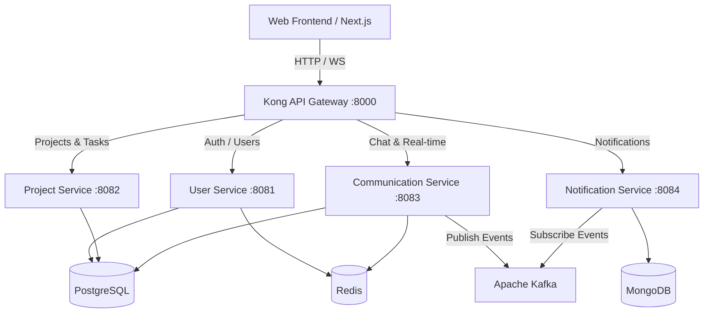

# WorkSpaceHub - Intelligent All-in-One Management Platform

WorkSpaceHub is an intelligent, all-in-one management platform designed to unify task tracking, real-time communication, scheduling, shared documentation, and productivity techniques (such as the Pomodoro method) into a cohesive ecosystem.

---

## 🌐 Overview & Abstract / Tổng Quan Đề Tài

### English Abstract

In the modern digital era, users increasingly struggle with application overload and fragmented workflows, continuously switching between separate platforms for communication, task management, scheduling, and document storage. This fragmentation significantly reduces productivity and compromises user experience in both personal work and group collaboration. To address this challenge, this thesis designs and implements an intelligent, all-in-one management platform that unifies task tracking, real-time communication, scheduling, shared documentation, and productivity techniques such as the Pomodoro method into a cohesive ecosystem. Distinct from traditional isolated tools, the proposed system enables seamless data interoperability between components, where project updates dynamically synchronize with individual calendars and communication threads. Furthermore, Artificial Intelligence (AI) is deeply integrated across the entire architecture, enhancing productivity through automated document summarization, intelligent scheduling recommendations, contextual assistance, quiz and flashcard generation from learning materials, and knowledge retrieval across projects and documents.

- **Keywords:** _Smart Management Platform, All-in-one Ecosystem, Artificial Intelligence Integration, Workflow Optimization, Group Collaboration._

### Thông Tin Đề Tài (Tiếng Việt)

| Tiêu chí                                 | Nội dung chi tiết                                                                                                                                                                                                                                                                                                                                                                |
| ---------------------------------------- | -------------------------------------------------------------------------------------------------------------------------------------------------------------------------------------------------------------------------------------------------------------------------------------------------------------------------------------------------------------------------------- |
| **Tên đề tài**                           | Xây dựng nền tảng hỗ trợ và quản lý công việc thông minh                                                                                                                                                                                                                                                                                                                         |
| **Mục tiêu đề tài**                      | Xây dựng hệ thống giúp người dùng quản lý tài liệu, công việc, làm việc và cộng tác nhóm trên một nền tảng thống nhất. Hệ thống tích hợp AI để hỗ trợ xử lý tài liệu, hỏi đáp nội dung, gợi ý kế hoạch làm việc, quản lý hiệu suất cá nhân và cộng tác nhóm.                                                                                                                     |
| **Dự kiến sản phẩm & khả năng ứng dụng** | Hệ thống **WorkSpaceHub** gồm web app hỗ trợ quản lý tài liệu, ghi chú, công việc, lịch, Pomodoro, workspace nhóm, chat realtime, AI Assistant, flashcard và dashboard thống kê. Ứng dụng cho sinh viên, người đi làm và các nhóm nhỏ trong học tập và làm việc.                                                                                                                 |
| **Mô tả hệ thống (Description)**         | WorkSpaceHub là nền tảng hỗ trợ làm việc cá nhân và cộng tác nhóm. Người dùng có thể quản lý tài liệu, ghi chú, công việc, lịch học/làm việc, Pomodoro và không gian làm việc nhóm. Hệ thống tích hợp AI để tóm tắt tài liệu, hỏi đáp theo nội dung tài liệu, tạo flashcard. Ngoài ra, hệ thống hỗ trợ chia sẻ tài liệu, chat realtime, thông báo và dashboard theo dõi tiến độ. |
| **Yêu cầu đầu vào (Input data)**         | Thông tin người dùng, tài liệu làm việc (PDF, slide, văn bản); dữ liệu task, deadline, lịch làm việc, ghi chú, dữ liệu chat nhóm, flashcard, phiên Pomodoro và các dữ liệu tương tác của người dùng trong hệ thống.                                                                                                                                                              |
| **Yêu cầu đầu ra (Output standards)**    | Hệ thống web hoạt động ổn định, giao diện dễ sử dụng, hỗ trợ đăng nhập/phân quyền, quản lý tài liệu, task, lịch, Pomodoro, workspace nhóm, chat realtime và dashboard thống kê. AI có thể hỗ trợ tóm tắt tài liệu, hỏi đáp theo tài liệu, tạo flashcard và quiz. Dữ liệu được lưu trữ an toàn, có phân quyền truy cập và hệ thống có khả năng mở rộng.                           |

---

## 🏗️ System Architecture & Technology Stack / Kiến Trúc Hệ Thống & Công Nghệ

WorkSpaceHub is designed using a **Microservices Architecture** with high performance, scalability, and loose coupling, orchestrated via Docker.



### 1. API Gateway Layer (Kong Gateway)

- **Technology:** Kong Gateway (Declarative configuration without database - DB-less mode).
- **Role:** Single entry point for all frontend requests, managing:
  - **Routing:** Directing `/api/auth` and `/api/users` to User Service, `/api/projects`, `/api/tasks`, `/api/pomodoros` to Project Service, `/api/conversations` and `/api/invitations` to Communication Service, and `/api/notifications` to Notification Service.
  - **Authentication:** Validates JWT tokens and injects custom context headers (`X-User-Id`, `X-User-Email`, `X-User-Role`) downstream via a custom `jwt-user-context` plugin.
  - **Global Policies:** CORS, Rate Limiting (600 req/min), Request Size Limiting (10 MB), and Correlation ID generation (`X-Request-ID` header using UUID).

### 2. Frontend Layer

- **Web Client:** \[Next.js\](file:///d:/HK1(2026-2027)/GraduationThesis/workspace_hub/frontend/web) (TypeScript, Tailwind CSS, App Router).
  - **Modules implemented:**
    - `(auth)`: Login, Signup, Forgot password, onboarding.
    - `(workspace)`: Workspace dashboard, Project management, Task board, Shared documentation, Real-time chat, Pomodoro timers, Calendars, AI assistant.
- **Mobile Client:** \[mobile\](file:///d:/HK1(2026-2027)/GraduationThesis/workspace_hub/frontend/mobile) (Folder created, ready for development).

### 3. Backend Microservices

- **\[User Service\](file:///d:/HK1(2026-2027)/GraduationThesis/workspace_hub/backend/user-service) (Java 21, Spring Boot 4.1):**
  - Handles authentication, user profile management, OAuth integrations, account settings, and file uploads.
  - _Tech stack:_ Spring Boot Starter Web/Security, Spring Data JPA, PostgreSQL, Redis, Lombok, MapStruct, AWS S3 SDK.
- **\[Project Service\](file:///d:/HK1(2026-2027)/GraduationThesis/workspace_hub/backend/project-service) (Java 21, Spring Boot 4.1):**
  - Manages projects/workspaces, tasks (checklists, comments, label mappings), Pomodoro configurations, and Pomodoro sessions tracking.
  - _Tech stack:_ Spring Boot Starter Web, Spring Data JPA, PostgreSQL, Lombok, Validation.
- **\[Communication Service\](file:///d:/HK1(2026-2027)/GraduationThesis/workspace_hub/backend/communication-service) (TypeScript, NestJS 11):**
  - Manages real-time 1-on-1 and group chats, messaging lifecycle (editing, pinning, recalling), file attachments, message reactions, group polls, and shared conversation notes.
  - _Tech stack:_ NestJS WebSockets & Platform Socket.io, Prisma ORM (PostgreSQL), Redis (Socket.io Adapter), KafkaJS.
- **\[Notification Service\](file:///d:/HK1(2026-2027)/GraduationThesis/workspace_hub/backend/notification-service) (TypeScript, NestJS 11):**
  - Event-driven notification service that processes events from the system message broker to push real-time alerts.
  - _Tech stack:_ NestJS Microservices (Kafka), MongoDB (Mongoose).
- **\[Document Service\](file:///d:/HK1(2026-2027)/GraduationThesis/workspace_hub/backend/document-service) & \[AI Service\](file:///d:/HK1(2026-2027)/GraduationThesis/workspace_hub/backend/ai-service):**
  - Services planned to handle shared document collaboration and AI features (summarization, question-answering, flashcard generation, quiz maker).

---

## 🗄️ Database Schemas & Storage Design / Cấu Trúc Cơ Sở Dữ Liệu

### Relational Database (PostgreSQL)

1. **User Entities:**
   - `User`: Credentials, status, and role metadata.
   - `UserProfile`: User specific details (full name, avatar, bio, timezone).
   - `AccountSetting`: User configuration settings.
   - `OAuthAccount`: Linked social log-ins.
   - `RefreshToken`: User session validation tokens.
2. **Project & Productivity Entities:**
   - `Project`, `ProjectMember`, `ProjectSetting`.
   - `Task`: Name, description, status, priority, due date.
   - `TaskAssignee`, `TaskChecklist`, `TaskComment`, `TaskLabel`, `TaskLabelMapping`.
   - `PomodoroConfig`: Work duration, short break, long break settings.
   - `PomodoroSession`: Duration, completed cycles, user session data.
   - `TimeTracking`: Logged working hours on specific tasks.
3. **Communication Entities (Prisma PostgreSQL schema):**
   - `Conversation`: Direct/Group, name, avatar, link to projects.
   - `ConversationMember`: Members, muted status, nickname, roles.
   - `Message`: Chat history with message types (Text, Image, File, System, Task, Poll, Note, Event, AI).
   - `Attachment`: Message files linked with S3 keys.
   - `Poll`, `PollOption`, `PollVote`: Group survey & poll structures.
   - `Note`: Knowledge notes shared inside channels.

### Document Database (MongoDB)

- **Notification Schema:**
  - `recipientId` (User UUID)
  - `senderId`, `senderName`, `senderAvatar` (Sender Context)
  - `type` (e.g. `CHAT`, `INVITATION`, `TASK`, `SYSTEM`)
  - `title`, `content` (Notification body)
  - `isRead` (Status)
  - `link` (Deep-link navigation inside client)
  - `metadata` (Custom data objects)

### Infrastructure & Message Broker

- **Apache Kafka:** Decouples event publishing (e.g. Chat alerts, Task assignments) from direct actions, allowing Notification Service to consume asynchronously.
- **Redis:** Serves as a token blacklist cache for User Service, and acts as the Socket.io pub-sub adapter for scaling real-time WebSocket communication in Communication Service.

---

## 📂 Project Structure / Cấu trúc thư mục

```text
workspace_hub/
├── backend/                       # Backend Microservices
│   ├── kong-gateway/              # Kong API Gateway Config
│   ├── docker/                    # Shared Infrastructure Docker Compose (PostgreSQL, Redis, Kafka)
│   ├── user-service/              # Spring Boot User Management Service
│   ├── project-service/           # Spring Boot Project & Productivity Service
│   ├── communication-service/     # NestJS Real-time Chat Service
│   ├── notification-service/      # NestJS Kafka Notification Service
│   ├── document-service/          # [Planned] Shared Document Service
│   └── ai-service/                # [Planned] AI Processing Service
├── frontend/                      # Client Interfaces
│   ├── web/                       # Next.js Web App Front-end
│   └── mobile/                    # [Planned] React Native/Flutter Mobile App
└── README.md                      # General system overview (this file)
```

---

## 🚀 How to Run the Project / Hướng dẫn khởi chạy

### Prerequisites

- **Docker Desktop** & **Docker Compose**
- **Java 21 SDK & Maven** (for Spring Boot services development)
- **Node.js (v20+) & npm** (for NestJS and Next.js development)

### Step 1: Start Shared Infrastructure

Navigate to the backend Docker directory and spin up the database, cache, gateway, and message broker:

```bash
cd backend/docker
docker-compose up -d
```

This starts:

- **Kong API Gateway** (Port `8000`)
- **PostgreSQL Database** (Port `5432`)
- **Redis Cache** (Port `6379`)
- **Apache Kafka** (Port `9092`)

### Step 2: Configure Environment Variables

Copy the `.env.example` file to `.env` in the services (`user-service`, `project-service`, `communication-service`, `notification-service`, `kong-gateway`) and fill in the necessary secrets (such as JWT keys and Database connections).

### Step 3: Run Microservices

Each service can be run locally in development mode:

- **User Service:**

  ```bash
  cd backend/user-service
  mvn spring-boot:run
  ```

- **Project Service:**

  ```bash
  cd backend/project-service
  mvn spring-boot:run
  ```

- **Communication Service:**

  ```bash
  cd backend/communication-service
  npm install
  npx prisma migrate dev
  npm run start:dev
  ```

- **Notification Service:**

  ```bash
  cd backend/notification-service
  npm install
  npm run start:dev
  ```

### Step 4: Run Frontend

- **Next.js Web Client:**

  ```bash
  cd frontend/web
  npm install
  npm run dev
  ```

  Open `http://localhost:3000` to interact with the platform.
