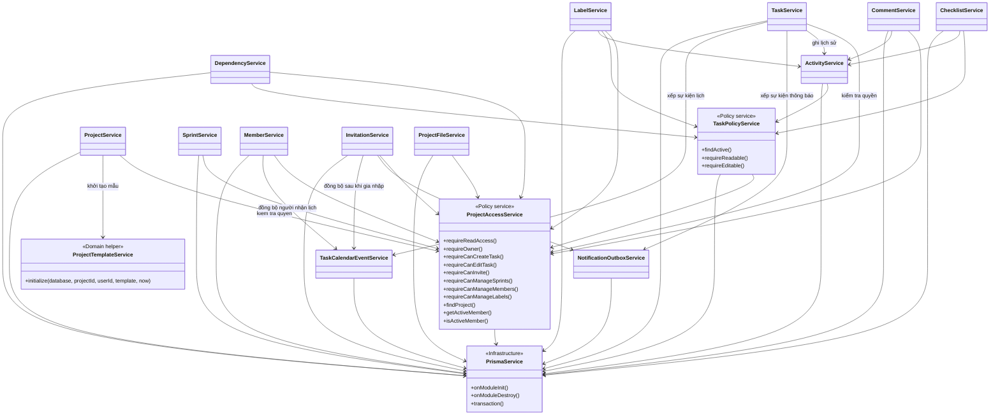
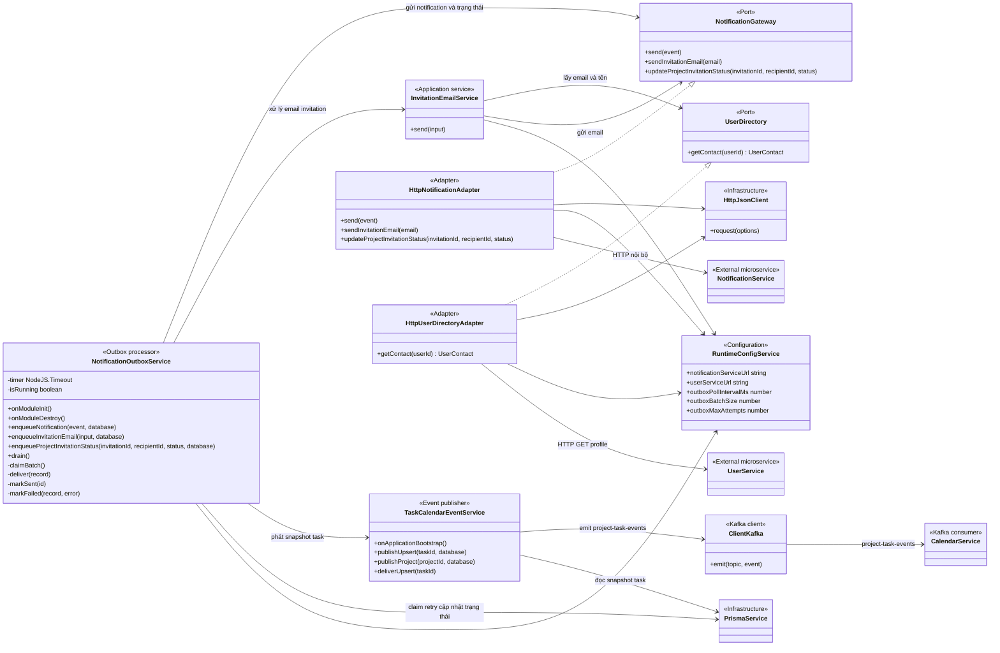
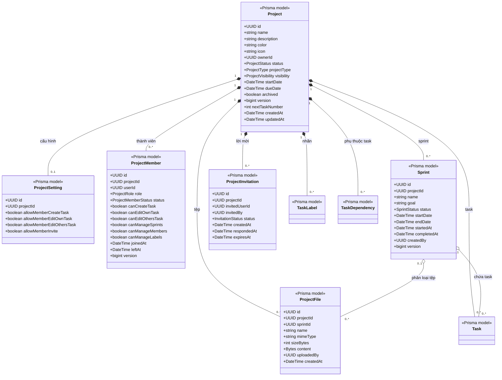
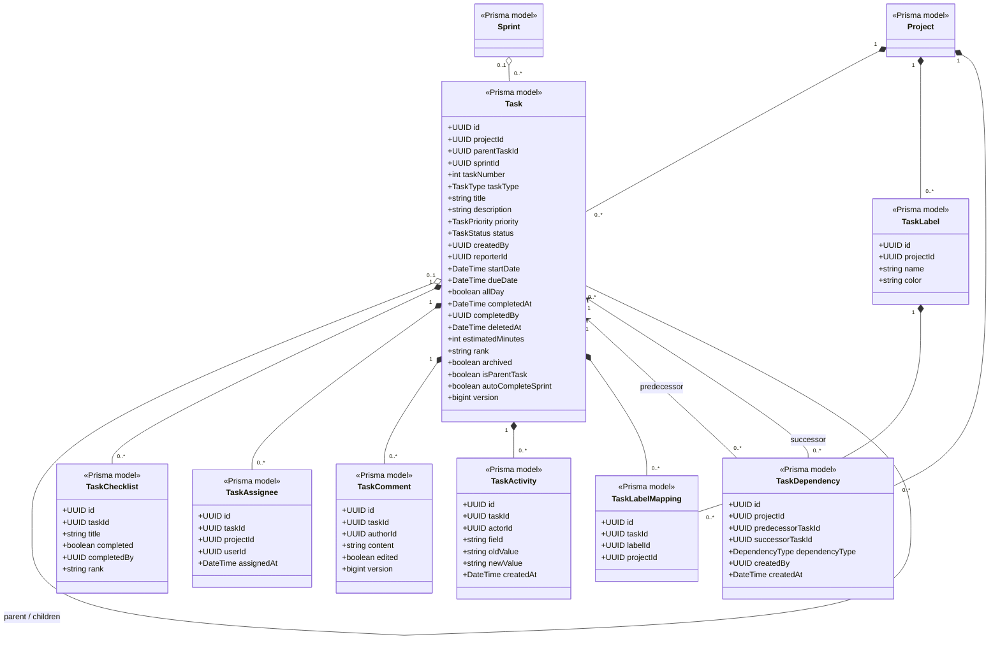
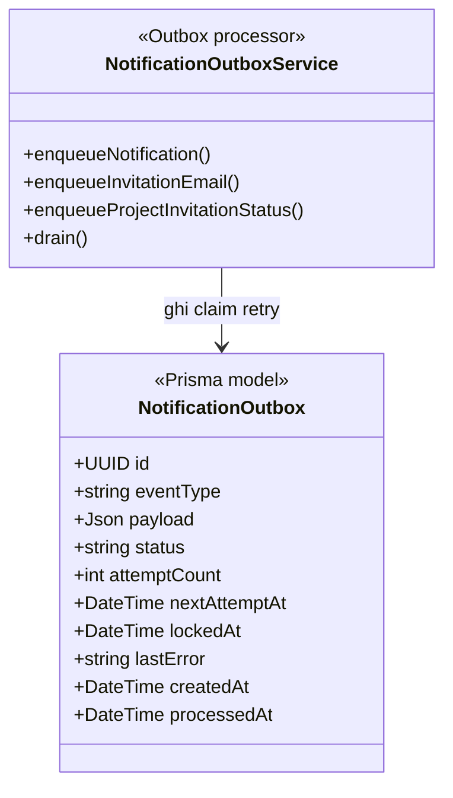

# Sơ đồ lớp Project Service

Tài liệu này được đối chiếu trực tiếp với mã nguồn NestJS và Prisma hiện tại của `project-service`. Các lớp trong sơ đồ là lớp có thật trong mã nguồn; các lớp mang stereotype `Prisma model` được Prisma Client sinh từ `prisma/schema.prisma`.

Bản chính dùng trong báo cáo là `PROJECT_SERVICE_CLASS_DIAGRAM_REPORT.drawio`. Sơ đồ này gộp toàn bộ domain class và enum vào một trang, dùng kiểu UML truyền thống giống Visual Paradigm: tên lớp, ngăn thuộc tính, association, multiplicity và `«enumeration»`.

## Bản tổng thể một trang dùng cho báo cáo

- `PROJECT_SERVICE_UML_CLASS_DIAGRAM_ONE_PAGE.drawio`: bản nguồn có thể chỉnh sửa.
- `PROJECT_SERVICE_UML_CLASS_DIAGRAM_ONE_PAGE.svg`: bản vector nên dùng khi chèn vào Word hoặc PowerPoint.
- `PROJECT_SERVICE_UML_CLASS_DIAGRAM_ONE_PAGE.png`: bản ảnh xem nhanh.

Bản một trang gộp toàn bộ 15 Prisma model và 12 enum. Các sơ đồ ở phần dưới được tách nhỏ để thuyết minh và kiểm tra chi tiết.

## 1. Phạm vi và quy ước

- `Controller` tiếp nhận HTTP request, lấy `userId` đã xác thực, kiểm tra DTO và chuẩn hóa response bằng `ApiResponse`.
- `Application service` điều phối nghiệp vụ và transaction.
- `Policy service` tập trung kiểm tra quyền truy cập và trạng thái task.
- `Port` là interface dùng để tách nghiệp vụ khỏi giao tiếp HTTP với service bên ngoài.
- `Adapter` hiện thực port bằng HTTP.
- `PrismaService` là lớp truy cập PostgreSQL dùng chung. Project Service hiện không định nghĩa lớp Repository riêng.
- Mũi tên `-->` biểu diễn phụ thuộc/gọi hàm; `..|>` biểu diễn implements; `*--` biểu diễn composition; `o--` biểu diễn aggregation.

## 2. Sơ đồ lớp API và application service

```mermaid
classDiagram
direction LR

class JwtIdentityGuard {
  <<Guard>>
  +canActivate(context) boolean
}
class ApiResponse~T~ {
  <<Response wrapper>>
  +success boolean
  +message string
  +data T
  +errors unknown
  +timestamp string
  +meta unknown
  +success(data, message, meta) ApiResponse
}

class ProjectController {
  <<Controller>>
  +create()
  +findAll()
  +findOne()
  +update()
  +archive()
}
class MemberController {
  <<Controller>>
  +findAll()
  +add()
  +updatePermissions()
  +remove()
}
class InvitationController {
  <<Controller>>
  +create()
  +findPending()
  +findProjectPending()
  +resend()
  +accept()
  +decline()
  +cancel()
}
class TaskController {
  <<Controller>>
  +create()
  +findAll()
  +findOne()
  +update()
  +delete()
}
class SprintController {
  <<Controller>>
  +list()
  +create()
  +addTasks()
  +update()
  +removeTask()
  +start()
  +complete()
  +reopen()
}
class CommentController {
  <<Controller>>
  +findAll()
  +create()
  +update()
  +delete()
}
class ChecklistController {
  <<Controller>>
  +create()
  +update()
  +remove()
}
class LabelController {
  <<Controller>>
  +list()
  +create()
  +update()
  +remove()
  +attach()
  +detach()
}
class DependencyController {
  <<Controller>>
  +list()
  +create()
  +remove()
}
class ActivityController {
  <<Controller>>
  +list()
}
class ProjectFileController {
  <<Controller>>
  +list()
  +upload()
  +download()
  +remove()
}

class ProjectService {
  <<Application service>>
  +create(userId, dto)
  +findAll(userId, query)
  +findOne(userId, projectId)
  +update(userId, projectId, dto)
  +archive(userId, projectId)
  +listMembers(userId, projectId)
}
class MemberService {
  <<Application service>>
  +add(userId, projectId, dto)
  +updatePermissions(userId, projectId, memberUserId, dto)
  +remove(userId, projectId, memberUserId)
}
class InvitationService {
  <<Application service>>
  +create(userId, projectId, dto)
  +findPending(userId)
  +findProjectPending(userId, projectId)
  +resend(userId, projectId, invitationId)
  +accept(userId, invitationId)
  +decline(userId, invitationId)
  +cancel(userId, projectId, invitationId)
}
class TaskService {
  <<Application service>>
  +create(userId, projectId, dto)
  +findAll(userId, projectId, query)
  +findOne(userId, taskId)
  +update(userId, taskId, dto)
  +delete(userId, taskId)
}
class SprintService {
  <<Application service>>
  +list(userId, projectId)
  +create(userId, projectId, dto)
  +addTasks(userId, sprintId, dto)
  +update(userId, sprintId, dto)
  +removeTask(userId, sprintId, taskId)
  +start(userId, sprintId)
  +complete(userId, sprintId)
  +reopen(userId, sprintId)
}
class CommentService {
  <<Application service>>
  +findAll(userId, taskId, query)
  +create(userId, taskId, dto)
  +update(userId, commentId, dto)
  +delete(userId, commentId)
}
class ChecklistService {
  <<Application service>>
  +create(userId, taskId, dto)
  +update(userId, checklistId, dto)
  +remove(userId, checklistId)
}
class LabelService {
  <<Application service>>
  +list(userId, projectId)
  +create(userId, projectId, dto)
  +update(userId, labelId, dto)
  +remove(userId, labelId)
  +attach(userId, taskId, labelId)
  +detach(userId, taskId, labelId)
}
class DependencyService {
  <<Application service>>
  +list(userId, projectId)
  +create(userId, successorTaskId, dto)
  +remove(userId, successorTaskId, predecessorTaskId)
}
class ActivityService {
  <<Application service>>
  +list(userId, taskId, query)
  +record(taskId, actorId, field, oldValue, newValue, database)
  +recordMany(taskId, actorId, changes, database)
}
class ProjectFileService {
  <<Application service>>
  +list(userId, projectId)
  +upload(userId, projectId, file, sprintId)
  +download(userId, projectId, fileId)
  +remove(userId, projectId, fileId)
}

JwtIdentityGuard ..> ProjectController : bảo vệ toàn cục
ProjectController --> ProjectService
MemberController --> MemberService
MemberController --> ProjectService : lấy danh sách thành viên
InvitationController --> InvitationService
TaskController --> TaskService
SprintController --> SprintService
CommentController --> CommentService
ChecklistController --> ChecklistService
LabelController --> LabelService
DependencyController --> DependencyService
ActivityController --> ActivityService
ProjectFileController --> ProjectFileService

ProjectController ..> ApiResponse
MemberController ..> ApiResponse
InvitationController ..> ApiResponse
TaskController ..> ApiResponse
SprintController ..> ApiResponse
CommentController ..> ApiResponse
ChecklistController ..> ApiResponse
LabelController ..> ApiResponse
DependencyController ..> ApiResponse
ActivityController ..> ApiResponse
ProjectFileController ..> ApiResponse
```

## 3. Sơ đồ dependency giữa các lớp nghiệp vụ

Điểm cần nhấn mạnh khi báo cáo: `ProjectAccessService` và `TaskPolicyService` giúp các use case không lặp lại logic phân quyền; những thay đổi task quan trọng ghi `TaskActivity` trong cùng transaction; thông báo và lịch được ghi vào outbox trước khi gửi ra ngoài.

## 4. Sơ đồ lớp tích hợp Notification, User và Calendar

Luồng tích hợp hiện tại:

1. `TaskService` hoặc `InvitationService` cập nhật dữ liệu nghiệp vụ và chèn bản ghi `NotificationOutbox` trong cùng transaction PostgreSQL.
2. `NotificationOutboxService` lấy bản ghi bằng `FOR UPDATE SKIP LOCKED`, chuyển sang `PROCESSING` rồi phân loại theo `eventType`.
3. Notification thường, email lời mời và trạng thái lời mời được gửi tới Notification Service qua `HttpNotificationAdapter`.
4. Sự kiện `PROJECT_TASK_CALENDAR` được chuyển cho `TaskCalendarEventService`, sau đó phát topic Kafka `project-task-events` để Calendar Service consume.
5. Thành công thì outbox chuyển `SENT`; lỗi thì chuyển `FAILED` và retry theo exponential backoff. Sự kiện lịch vẫn được giữ khả năng retry sau giới hạn thử thông thường.

## 5. Sơ đồ lớp domain: Project aggregate

Ràng buộc nổi bật: mỗi project có tối đa một `ProjectSetting`; một user chỉ có một `ProjectMember` trong một project; `nextTaskNumber` cấp số task duy nhất theo project; `version` hỗ trợ optimistic concurrency control.

## 6. Sơ đồ lớp domain: Task aggregate

Ràng buộc nghiệp vụ nổi bật:

- Task con chỉ có tối đa hai cấp và phải cùng project, cùng sprint với task cha.
- Task chỉ được đưa vào sprint đang `PLANNED`; một project phần mềm chỉ có một sprint `ACTIVE` tại một thời điểm.
- Dependency chỉ nối hai task cùng project, không tự phụ thuộc và không tạo chu trình.
- Label được gắn qua `TaskLabelMapping`; cặp `(taskId, labelId)` là duy nhất.
- Xóa task là soft delete qua `deletedAt`; `version` dùng phát hiện ghi đồng thời.

## 7. Lớp Outbox độc lập

`NotificationOutbox` không có khóa ngoại tới `Project` hoặc `Task`. Đây là chủ ý của Transactional Outbox: payload là snapshot JSON, cho phép bản ghi sự kiện còn tồn tại và retry ngay cả khi aggregate nguồn đã đổi hoặc bị xóa.

## 8. Enumerations

Các enum được đặt ở trang `3 - Enumerations` trong file Draw.io hoàn chỉnh:

| Enum | Giá trị |
|---|---|
| `ProjectStatus` | `ACTIVE`, `ON_HOLD`, `COMPLETED`, `ARCHIVED` |
| `ProjectType` | `GENERAL`, `SOFTWARE_DEVELOPMENT` |
| `ProjectTemplate` | `EMPTY`, `SOFTWARE_SCRUM`, `MARKETING_CAMPAIGN`, `EVENT_PLAN` |
| `ProjectVisibility` | `PRIVATE`, `MEMBERS_ONLY`, `PUBLIC` |
| `ProjectRole` | `OWNER`, `MEMBER` |
| `ProjectMemberStatus` | `ACTIVE`, `LEFT`, `REMOVED` |
| `SprintStatus` | `PLANNED`, `ACTIVE`, `COMPLETED` |
| `TaskStatus` | `TODO`, `IN_PROGRESS`, `IN_REVIEW`, `DONE`, `CANCELLED` |
| `TaskPriority` | `LOW`, `MEDIUM`, `HIGH`, `URGENT` |
| `TaskType` | `TASK`, `BUG`, `STORY`, `EPIC`, `SUBTASK` |
| `InvitationStatus` | `PENDING`, `ACCEPTED`, `DECLINED`, `CANCELLED`, `EXPIRED` |
| `DependencyType` | `FINISH_TO_START`, `START_TO_START`, `FINISH_TO_FINISH` |

`NotificationOutbox.status` hiện dùng các chuỗi hằng `PENDING`, `PROCESSING`, `SENT`, `FAILED`; trong code chưa khai báo TypeScript enum riêng nên sơ đồ không biểu diễn nó như một enum.

## 9. DTO đầu vào chính

| Nhóm | DTO | Thuộc tính chính |
|---|---|---|
| Project | `CreateProjectDto` | `name`, `color`, `icon`, `description`, `projectType`, `template`, `visibility`, `startDate`, `dueDate` |
| Project | `UpdateProjectDto` | `name`, `color`, `icon`, `status`, `description`, `projectType`, `visibility`, `startDate`, `dueDate` |
| Member | `AddMemberDto` | `userId` |
| Member | `UpdateMemberPermissionsDto` | sáu quyền tạo/sửa task và quản lý sprint/member/label |
| Invitation | `CreateInvitationDto` | `invitedUserId` |
| Task | `CreateTaskDto` | `sprintId`, `title`, `description`, `priority`, `status`, `taskType`, ngày, thời lượng, rank, parent |
| Task | `UpdateTaskDto` | các trường task có thể đổi, `assigneeUserId`, `archived`, `clearParent` |
| Sprint | `CreateSprintDto`, `UpdateSprintDto` | `name`, `goal`, `startDate`, `endDate` |
| Sprint | `AddSprintTasksDto` | `taskIds[]` |
| Comment | `CreateCommentDto`, `UpdateCommentDto` | `content` |
| Checklist | `CreateChecklistDto`, `UpdateChecklistDto` | `title`, `completed` |
| Label | `CreateLabelDto`, `UpdateLabelDto` | `name`, `color` |
| Dependency | `CreateDependencyDto` | `predecessorTaskId`, `dependencyType` |

## 10. Cách trình bày trong báo cáo khóa luận

Có thể trình bày theo thứ tự: sơ đồ API/application service để giải thích luồng request; sơ đồ dependency để giải thích phân quyền và tái sử dụng nghiệp vụ; sơ đồ integration để bảo vệ lựa chọn Transactional Outbox; cuối cùng là hai sơ đồ domain để mô tả cấu trúc dữ liệu. Khi xuất hình, nên xuất từng khối Mermaid thành SVG riêng để chữ vẫn rõ khi đưa vào Word hoặc PowerPoint.

Nguồn đối chiếu chính: `src/modules/project/project.module.ts`, các controller/service trong `src/modules/project`, các port/adapter trong `src/modules/project/communication`, `src/infrastructure/kafka/project-kafka.module.ts` và `prisma/schema.prisma`.
