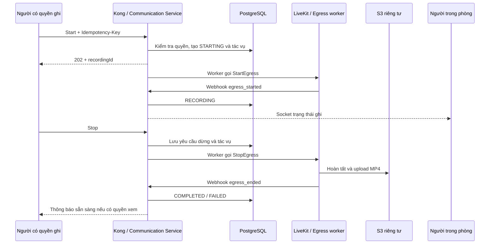

# Đặc tả đề xuất: ghi cuộc họp và phân quyền

Ngày: 09/10/2026. Đây là contract để triển khai, chưa phải API đang tồn tại.

## 1. Quyết định và trải nghiệm

Người dùng đã chọn lưu máy chủ/S3; host/co-host được bắt đầu/dừng; thành viên thường phải được host cấp quyền; bản ghi mặc định chỉ chủ sở hữu truy cập, có chia sẻ theo quyền.

Các quy tắc chi tiết dưới đây là đề xuất triển khai:

- Bản đầu ghi một video MP4 720p chứa âm thanh chung, camera và screen share. Dùng nguồn template để ghép phòng; ưu tiên screen share, chuyển về camera khi hết chia sẻ. Kiểm tra hành vi template mặc định; nếu cần chỉnh layout thì dùng `UpdateLayout` hoặc template riêng.
- Record → Starting → REC + thời gian → Stop → Processing → Ready/Failed. Người trong phòng và người vào muộn đều thấy thông báo đang ghi. Timer dựa trên thời điểm Egress thực sự bắt đầu, không dựa trên thời điểm bấm nút.
- Mỗi meeting chỉ có một bản ghi ở trạng thái STARTING/RECORDING/PROCESSING. Sau COMPLETED/FAILED có thể bắt đầu bản mới nếu meeting vẫn LIVE. Stop rồi start tạo file mới, hiển thị thành các bản ghi riêng.
- Người tạo meeting (`createdBy`) là chủ sở hữu lưu trong `ownerId`; `startedBy` chỉ ghi nhận người thao tác. Chuyển host không tự chuyển quyền sở hữu/chia sẻ file; UI phải ghi rõ ai sở hữu bản ghi.
- Bản đầu có ghi thủ công, xem, tải, chia sẻ, thu hồi và xóa. Tạm dừng/tiếp tục cùng một file, ghép nhiều đoạn, auto-record, transcript và AI tóm tắt thuộc đợt sau.

Trải nghiệm trong phòng cần triển khai rõ:

| Tình huống | Hành vi dự kiến |
|---|---|
| Bấm Record | Xác nhận chủ sở hữu/phạm vi ghi; gọi API, hiện Starting; không gọi `getDisplayMedia` hoặc yêu cầu chọn màn hình |
| Egress bắt đầu ghi | Mọi người thấy REC/timer và thông báo; người vào muộn cũng được thông báo |
| Chưa có screen share | Bố cục camera người đang nói mặc định hoặc dạng lưới; luôn có âm thanh các track được phát |
| Có screen share | Màn hình chia sẻ lớn, camera nhỏ; chỉ ghi tab/cửa sổ/màn hình mà người chia sẻ đã chọn |
| Dừng/đổi người chia sẻ | Đổi bố cục/track trong cùng phiên ghi, không stop/start Egress; giữ âm thanh liên tục |
| Tất cả tắt camera | Hiện avatar/nền phù hợp, vẫn ghi âm thanh; không coi đây là lỗi |
| Bấm Stop | Xác nhận dừng, hiện Processing; sau thành công có bản ghi trong Recordings theo quyền |

Record và Share screen có hai policy độc lập. Quyền ghi không cho phép tự lấy màn hình máy khác, và không cho phép screen share nếu host đang tắt quyền đó. Âm thanh tab/hệ thống chỉ được ghi nếu browser hỗ trợ, người dùng bật chia sẻ âm thanh và ứng dụng publish track âm thanh đó; micro vẫn theo track hiện tại. Bố cục ghép của máy chủ độc lập với pin/layout cá nhân. Ưu tiên template có sẵn; nếu thiếu bố cục yêu cầu thì bổ sung template riêng, không đưa UI chat/settings vào video.

## 2. Kiến trúc và điểm tích hợp

Thêm `MeetingRecordingController`, `MeetingRecordingService`, `MeetingRecordingPolicyService` và worker phục hồi tác vụ trong module meeting. Mở rộng `LiveKitService` bằng EgressClient; mở rộng `S3Service` bằng HEAD và URL GET ký có hạn. Giữ secrets và quyền LiveKit `roomRecord` ở backend/worker; token participant không có quyền này.

Compose thêm Egress worker cùng network và Redis của LiveKit. Cấu hình địa chỉ mà container truy cập được, webhook endpoint, S3 prefix riêng và healthcheck. Pin image đã kiểm thử tương thích; không dùng tag `latest`. Tài liệu LiveKit khuyến nghị tối thiểu 4 CPU/4 GB cho mỗi Egress instance; đo lại với 720p và giới hạn số phòng ghi đồng thời theo tài nguyên máy.

Kong giữ JWT cho API người dùng. Nếu webhook đi qua Kong, thêm route chính xác `/api/meetings/livekit/webhook` dùng chữ ký LiveKit thay cho JWT người dùng; xác thực raw body bằng `WebhookReceiver`. Bảo vệ đường truy cập service trực tiếp để client không giả `x-user-id`. Cập nhật cả `kong.host.yml` và `kong.docker.yml`.

## 3. Ma trận quyền

| Thao tác | Host hiện tại đang JOINED | Co-host đang JOINED | Participant đang JOINED được cấp quyền | Người có quyền xem file |
|---|---|---|---|---|
| Xem trạng thái đang ghi trong phòng | Có | Có | Có; thành viên thường cũng có | Theo quyền truy cập bản ghi |
| Bắt đầu ghi khi meeting LIVE | Có | Có | Có | Không, trừ khi có quyền điều khiển riêng |
| Dừng bản ghi | Bất kỳ bản đang ghi trong phòng | Bất kỳ bản đang ghi trong phòng | Chỉ bản do mình bắt đầu và còn quyền ghi | Không |
| Cấp/thu hồi quyền ghi của participant | Có | Không | Không | Không |
| Xem/tải/chia sẻ/xóa file | Theo quyền sở hữu/ACL | Theo quyền sở hữu/ACL | Theo quyền sở hữu/ACL | Xem; tải nếu được cho phép |

- Backend kiểm tra meeting LIVE, participant JOINED và vai trò/quyền hiện tại cho mỗi thao tác điều khiển, kể cả host. Không chỉ dựa vào `hostId` hoặc nút ẩn ở frontend.
- Host cấp `canRecord` cho participant đang JOINED; quyền này hết khi rời/bị loại khỏi phòng, không tự khôi phục khi vào lại. Co-host có quyền theo vai trò và mất quyền đó ngay khi bị hạ vai trò.
- Thu hồi quyền ghi không dừng Egress đột ngột: phiên ghi thuộc phòng tiếp tục, host/co-host điều khiển. Người bị thu hồi mất quyền start/stop ngay. Rời phòng của người bấm Record cũng không tự kết thúc bản ghi.
- Chỉ `ownerId` sửa tên, chia sẻ, thu hồi quyền xem/tải hoặc xóa file. Host/co-host không mặc nhiên được xem file sau meeting; màn hình xác nhận ghi phải nêu bản ghi thuộc người tạo meeting.
- Quyền xem file được kiểm tra riêng và hoạt động khi meeting ENDED. Không dùng policy yêu cầu JOINED cho thư viện bản ghi.
- Chia sẻ cho danh sách tài khoản tạo ACL `canView`, `canDownload`. Chia sẻ cho người tham gia lấy danh sách những người thực sự đã tham dự tới thời điểm dừng từ lịch sử tham gia; loại người bị kick, không lấy người chỉ được mời hoặc chờ duyệt. Chụp danh sách thành ACL, không tự cấp cho người tham gia một cuộc gọi sau này.
- Bị loại khỏi phòng: thu hồi quyền ghi và ACL xem/tải của meeting; chủ sở hữu vẫn sở hữu file. Chỉ chủ sở hữu có thể chia sẻ lại rõ ràng sau cuộc họp. Thu hồi trên UI phải cập nhật cache và người nhận qua socket.
- Biết joinToken/recordingId không cấp quyền file. URL S3 đã ký còn hiệu lực tới lúc hết hạn; đặt TTL mặc định 5 phút và ghi rõ giới hạn này. Nếu cần thu hồi ngay cả URL đã cấp phải thêm proxy streaming. Quyền tải chỉ kiểm soát nút/API tải, không ngăn người xem lưu nội dung đã phát.

## 4. API đề xuất

Prefix chung `/api/meetings`. `:joinToken` dùng cho điều khiển phòng hiện có; `:recordingId` là UUID. Đăng ký route tĩnh `/recordings` trước route động `/:joinToken` khi cần. Mọi API người dùng lấy userId từ ngữ cảnh JWT đã xác thực.

| Method và path sau prefix | Nội dung | Quyền |
|---|---|---|
| `GET /:joinToken/recordings/status` | Bản ghi đang hoạt động/null, thời gian, khả năng ghi, quyền hiện tại | Participant JOINED |
| `POST /:joinToken/recordings` | Bắt đầu ghi; body `{ layout: "speaker" \| "grid" }`; layout mặc định speaker với screen share ưu tiên | Host/co-host hoặc participant được cấp |
| `POST /:joinToken/recordings/:recordingId/stop` | Yêu cầu dừng bản ghi thuộc đúng meeting | Theo ma trận dừng |
| `PATCH /:joinToken/participants/:userId/recording-permission` | `{ canRecord: true/false }` | Host JOINED |
| `GET /recordings` | Thư viện bản ghi được phép truy cập; `page`, `limit` tối đa 50, `search`, `status`, `meetingId`, `scope=owned/shared/all` | Chủ sở hữu hoặc ACL |
| `GET /:joinToken/recordings` | Bản ghi trong một meeting, vẫn lọc quyền file | Chủ sở hữu hoặc ACL |
| `GET /recordings/:recordingId` | Metadata và capabilities | Chủ sở hữu hoặc ACL |
| `POST /recordings/:recordingId/playback-url` | URL GET ký cho player, `{ url, expiresAt }` | canView; COMPLETED |
| `POST /recordings/:recordingId/download-url` | URL GET ký có Content-Disposition attachment | Chủ sở hữu/canDownload; COMPLETED |
| `PATCH /recordings/:recordingId` | `{ title }`, giới hạn độ dài | Chủ sở hữu |
| `GET /recordings/:recordingId/permissions` | ACL hiện tại | Chủ sở hữu |
| `PUT /recordings/:recordingId/permissions/:userId` | Tạo/cập nhật `{ canView: true, canDownload: boolean }` | Chủ sở hữu |
| `POST /recordings/:recordingId/permissions/participants` | Cấp ACL cho danh sách người đã tham dự hợp lệ; `{ canDownload: false }` mặc định | Chủ sở hữu |
| `DELETE /recordings/:recordingId/permissions/:userId` | Thu hồi ACL | Chủ sở hữu |
| `DELETE /recordings/:recordingId` | Chặn truy cập ngay, lên lịch xóa object/ACL | Chủ sở hữu; bản ghi đã COMPLETED/FAILED |
| `POST /livekit/webhook` (đã có) | Bổ sung `egress_started`, `egress_updated`, `egress_ended` | Chữ ký LiveKit |

Contract thành công dùng `{ message, data }` như controller hiện tại. Metadata gồm `id`, `meetingId`, `title`, `ownerId`, `startedBy`, `stoppedBy`, `status`, `layout`, `startedAt`, `stoppedAt`, `completedAt`, `durationSeconds`, `sizeBytes` và `capabilities`. Không trả secrets, S3 key hoặc URL ký trong danh sách/socket. `sizeBytes` truyền JSON dạng chuỗi để hỗ trợ BigInt. Status response có `recordingAvailable`, `unavailableReason` và các quyền `canStart`, `canStop`, `canGrantRecord`.

Start/stop dùng `Idempotency-Key`: lưu theo userId, meetingId, loại thao tác và body hash. Cùng key/body trả lại kết quả cũ; cùng key khác body trả 409. Start trả 202 với STARTING; stop trả 202 khi mới yêu cầu dừng và 200 khi bản ghi đã kết thúc. Start khác key trong lúc có bản ghi hoạt động trả 409 kèm metadata an toàn. Delete trả 202 khi xóa file nền; gọi lại vẫn thành công.

Lỗi: 400 DTO sai; 401 chưa xác thực; 403 không có quyền thao tác đối với tài nguyên đã được phép thấy; 404 không tồn tại/không được thấy hoặc recording không thuộc meeting; 409 trạng thái xung đột/file chưa sẵn sàng; 429 quá giới hạn; 503 Egress/lưu trữ chưa sẵn sàng. Bổ sung mã lỗi máy đọc được `RECORDING_FORBIDDEN`, `RECORDING_ALREADY_ACTIVE`, `RECORDING_NOT_READY`, `RECORDING_UNAVAILABLE` bằng thay đổi tương thích trong exception filter hiện có.

## 5. Dữ liệu và vòng đời

- Mở rộng `MeetingRecording`: `ownerId`, `title`, `layout`, `requestedAt`, `stopRequestedAt`, `failureCode`, `failureMessage` đã làm sạch, `updatedAt`, `deletedAt`, `version`; `startedAt` nullable tới khi Egress xác nhận, `livekitEgressId` unique và `sizeBytes` BigInt. Giữ các trường S3/file/thời lượng hiện có.
- Thêm `MeetingParticipant.canRecord` mặc định false và thông tin người/thời điểm cấp; thêm `MeetingRecordingPermission` unique `(recordingId, userId)` với canView/canDownload/grantedBy và timestamps.
- Thêm bảng tác vụ recording phục vụ START/STOP/DELETE và idempotency: request key/body hash, trạng thái, attempt, retryAt, lease expiry. Thêm receipt webhook unique eventId. Bảng nhỏ này bảo đảm lệnh đã trả 202 không mất khi backend restart.
- Migration PostgreSQL tạo partial unique index trên meetingId cho STARTING/RECORDING/PROCESSING. Dữ liệu cũ backfill ownerId từ createdBy và sizeBytes sang BigInt. Không giữ transaction DB mở trong lúc gọi LiveKit/S3.
- State machine: STARTING → RECORDING → PROCESSING → COMPLETED; lỗi start/encode/upload → FAILED; COMPLETED/FAILED → DELETED. Dừng trong STARTING lưu stopRequestedAt và PROCESSING để worker dừng ngay khi biết egressId, kể cả webhook ACTIVE đến muộn.
- Tạo recordingId và S3 key duy nhất trước khi gọi Egress; lưu cấu hình request trong tác vụ. Nếu start timeout sau khi LiveKit đã nhận lệnh, đối soát `listEgress` bằng room và output key, lấy lại egressId trước khi retry; không gọi start mù tạo hai worker ghi.
- `egress_started/updated/ended` xác thực chữ ký, khớp room/output/egressId với dữ liệu server, nhận và xử lý idempotent; webhook không khớp được lưu để đối soát nếu đến trước response start. Không để sự kiện cũ kéo COMPLETED/FAILED/DELETED về RECORDING.
- COMPLETED chỉ khi Egress xác nhận thành công và object đúng bucket/key tồn tại, size hợp lệ. Quy đổi timestamp/duration từ đơn vị SDK sang UTC/giây, không ép BigInt thành số sai độ chính xác. Không tin đường dẫn arbitrary từ client/webhook để đọc hoặc xóa file khác.
- End meeting: khóa trạng thái ngăn start mới, lên lịch StopEgress trước khi dọn phòng; không chờ upload để kết thúc meeting. `room_finished` và worker tự kết thúc cũng đi qua cùng reducer. Reconciliation định kỳ phục hồi STARTING/PROCESSING, tác vụ pending và Egress còn chạy cho phòng đã kết thúc.
- Xóa: chuyển DELETED/chặn mọi URL mới trước, tác vụ xóa S3 idempotent và retry khi lỗi; giữ audit. Giới hạn thời lượng và số phòng ghi đồng thời cấu hình ở backend. Chính sách tự hết hạn lưu trữ và quota theo workspace để đợt sau; bản đầu vẫn đo dung lượng và có xóa thủ công.

## 6. Upload MP4 lớn lên S3

- Luồng dữ liệu: LiveKit → Egress encode/file tạm → uploader S3 của worker. Communication Service chỉ gửi lệnh/lưu metadata; không nhận body MP4 qua HTTP và không tải file về RAM để upload lại.
- Sử dụng multipart trong uploader Egress cho file lớn; xác nhận trong image đã pin thay vì suy từ nhánh main. Thư viện storage hiện tại dùng AWS upload manager; không xây API init/part/complete ở frontend cho luồng record này. Multipart là các phần của một object, không phải các video riêng; object hoàn chỉnh chỉ sẵn sàng sau complete. MP4 có thể cần hoàn tất cục bộ trước khi upload, không hứa upload ngay khi đang ghi.
- Nếu phải bổ sung worker upload dự phòng, đọc bằng file stream, chọn ban đầu part 16 MiB và tối đa 3 phần đồng thời; các giá trị này là cấu hình của worker bổ sung, không mặc nhiên là tùy chọn Egress. Kiểm tra giới hạn part và điều chỉnh với dung lượng tối đa; retry từng phần với backoff, lưu uploadId/part ETag nếu cần tiếp tục sau restart. Không tự ghi đè uploader tích hợp khi chưa có bằng chứng cần thay.
- Mount volume ghi tạm bền vững, thư mục theo recordingId; xác nhận file hoàn tất hợp lệ trước khi đưa vào hàng đợi upload lại. Dung lượng dự toán: `(videoBitrate + audioBitrate) × thời lượng / 8`, cộng dự phòng cho nhiều phiên và file chờ upload. Từ chối start khi worker thiếu tài nguyên/đĩa, đặt thời lượng tối đa qua config, cảnh báo trước giới hạn.
- Kiểm thử tính năng lưu bản sao khi upload lỗi của image Egress được chọn. Nếu có bản sao hoàn chỉnh thì lưu tham chiếu nội bộ và tác vụ upload retry bền vững; nếu không có, báo FAILED rõ ràng. Restart backend có thể phục hồi điều khiển, nhưng crash Egress giữa lúc encode không bảo đảm cứu được MP4. Không xóa file phục hồi trước khi xác nhận S3 hoặc trước hạn lưu tạm đã công bố.
- Upload lỗi tạm thời còn tác vụ retry thì giữ PROCESSING và thông tin tiến trình phù hợp; hết ngân sách retry hoặc file không phục hồi được mới FAILED. COMPLETE yêu cầu Egress/worker báo thành công và kiểm tra HEAD đúng object, size/checksum khi khả dụng. Không dùng ETag như checksum MD5 toàn file cho multipart.
- Lifecycle `AbortIncompleteMultipartUpload` đề xuất 7 ngày trên prefix recording; phải dài hơn cửa sổ retry/resume để tránh dọn upload đang được phục hồi. Thiết lập riêng việc dọn file tạm sau thành công hoặc hết hạn phục hồi.
- S3 giữ bucket private; Egress chỉ ghi prefix recording; worker/API có quyền đọc/xóa/abort theo nhiệm vụ. Multipart không giảm dung lượng tổng; kiểm soát bằng 720p/bitrate, giới hạn thời lượng, xóa theo quyền và theo dõi chi phí.
- HLS để đợt sau nếu cần đẩy từng đoạn khi đang ghi hoặc xem sớm. Khi thêm HLS cần bảo vệ playlist và tất cả segment, thay đổi player/metadata/xóa cả prefix; URL ký của riêng playlist không bảo vệ hoặc tự cấp quyền cho segment.

## 7. Socket, thông báo và frontend

- `meeting:recording_updated`: phát cho phòng đang họp `{ meetingId, recordingId, status, startedAt, stoppedAt, version }`; không gửi URL hoặc quyền sở hữu file qua kênh công khai/lobby.
- `meeting:recording_permission_updated`: phát cho user bị thay đổi và moderators; cập nhật participant menu, refetch capabilities sau chuyển host/hạ vai trò/rời phòng.
- `meeting:recording_ready`, `meeting:recording_failed`, `meeting:recording_deleted`, `meeting:recording_access_updated`: phát theo userId có quyền phù hợp, không broadcast metadata thư viện cho tất cả người từng tham dự.
- REST status là nguồn đối soát khi join/reconnect; bỏ sự kiện socket version cũ. Timer đồng bộ từ timestamp backend. Có polling dự phòng khi mất socket, dừng polling khi không còn cần.
- Cập nhật `meeting-room-footer.tsx`, shell/content, participants panel, `meeting.api.ts`, constants/types/query keys và hook mới `useMeetingRecording`; trình bày rõ STARTING/PROCESSING/FAILED và trạng thái dịch vụ không khả dụng.
- Mở `meeting-sidebar.tsx` và `meeting-layout.tsx` cho Recordings; thêm `MeetingRecordingsView`, player và share dialog. URL hết hạn thì kiểm tra quyền và xin URL mới, giữ vị trí đang xem. S3/CORS cho phép browser GET/HEAD và seek Range.
- Thông báo bản ghi hoàn tất cho owner và người đã được chia sẻ qua notification-service hiện có. Người bấm Record nhưng không có quyền xem chỉ nhận trạng thái điều khiển phù hợp, không được cấp quyền xem ngầm.

## 8. Tiêu chí nghiệm thu

1. Host/co-host JOINED start/stop được; participant thường bị chặn; cấp/thu hồi quyền có hiệu lực ngay, chỉ dừng được phiên của mình; giả header và đổi meetingId/recordingId không vượt quyền.
2. Hai request start đồng thời, retry cùng key, stop trong STARTING và backend restart không tạo hai phiên/file, không mất lệnh đã nhận. Chuyển host/hạ vai trò không giữ quyền điều khiển cũ.
3. Hai hoặc ba browser họp: file có âm thanh nhiều người, camera, screen share; đổi người chia sẻ/tắt camera không làm bản ghi mất luồng âm thanh. Người vào muộn thấy thông báo REC, timer đúng khi reconnect.
4. Webhook sai chữ ký bị từ chối; webhook trùng/sai thứ tự/mất webhook, lỗi worker hoặc S3 dẫn tới trạng thái đúng và thông báo phù hợp; không treo STARTING/PROCESSING vô hạn.
5. End meeting dừng record và hoàn tất upload; người start rời phòng nhưng cuộc họp còn người vẫn ghi tiếp. Hủy phòng chưa bắt đầu không tạo record.
6. Meeting đã ENDED vẫn xem được theo owner/ACL. Người chỉ được mời, biết join link hoặc chưa có ACL không thấy metadata/file; chia sẻ người tham dự không cấp cho người chờ duyệt/bị kick.
7. ACL xem/tải, thu hồi, URL hết hạn/làm mới, seek video, xóa S3 lỗi và retry đều hoạt động. Kiểm tra giới hạn hiệu lực 5 phút của URL đã cấp sau thu hồi.
8. Chạy Jest và kiểm thử API tích hợp với PostgreSQL migration thật; backend/frontend lint, typecheck và build phần thay đổi; E2E cuối dùng Egress và S3 thật. Ghi nhận thời gian xử lý, CPU/RAM và dung lượng file để đặt giới hạn demo/production.
9. MP4 thử trên 100 MB upload multipart, không đi qua Kong/Communication Service; ngắt mạng khi upload, kiểm tra retry, volume tạm, abort/dọn upload và hành vi sau restart worker. Đo RAM theo cấu hình buffer/concurrency, không tăng theo toàn bộ file. Không chuyển COMPLETED khi thiếu object; file upload xong phát và seek được.
10. Bấm Record không gọi hộp chọn màn hình; quyền ghi/screen share độc lập; đổi người chia sẻ và quay về camera không tách file. Kiểm tra âm thanh micro, screen audio khi được hỗ trợ và tình huống tất cả tắt camera.

## Nguồn kỹ thuật

- [Egress overview](https://docs.livekit.io/transport/media/ingress-egress/egress/): nguồn template, output MP4, worker riêng khi self-host.
- [Egress API](https://docs.livekit.io/reference/other/egress/api/): StartEgress, StopEgress, ListEgress, UpdateLayout và quyền roomRecord; StartEgress cần server từ v1.13.5, API cũ StartRoomCompositeEgress đã deprecated.
- [Self-host Egress](https://docs.livekit.io/transport/self-hosting/egress/): Redis dùng chung, yêu cầu tài nguyên và cấu hình Chrome sandbox theo image được chọn.
- [Webhooks & events](https://docs.livekit.io/intro/basics/rooms-participants-tracks/webhooks-events/): egress_started, egress_updated, egress_ended và xác thực webhook.
- [S3 multipart upload](https://docs.aws.amazon.com/AmazonS3/latest/userguide/mpuoverview.html): upload từng phần, retry, complete/abort và lifecycle dọn phần bỏ dở.
- [LiveKit storage S3 implementation](https://github.com/livekit/storage/blob/main/s3.go): uploader dùng AWS upload manager; đối chiếu lại version được đóng gói trong image triển khai.
- [LiveKit output options](https://docs.livekit.io/transport/media/ingress-egress/egress/outputs/): MP4 và HLS, cấu hình output/storage.
